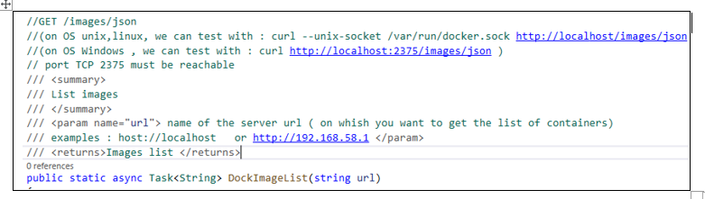

# DockerLibr

 

Library of methods working on Docker Hub . Methods get and parse Docker containers & images in Docker Hub repository

# Download

Download the nuget package at : https://www.nuget.org/packages/DockerLibr/

# Dependency 

. use with Netcoreapp5.0 

. package Newtonsoft.Json;

. Packages referenced in the Library :

https://github.com/guihen01/DockerLibr/blob/main/Doc/Capture1.PNG

# How to use 

1. Download the nuget package at : https://www.nuget.org/packages/DockerLibr/
2. USe Visual Studio or tool that use Nuget
3. in your c# code use the method(s) you choose in the lib
4. include the reference : using DockerLibr;

https://github.com/guihen01/DockerLibr/blob/main/Doc/List%20of%20objects.PNG

https://github.com/guihen01/DockerLibr/blob/main/Doc/How%20to%20use.PNG

# List of Methods in the library 

| Methods :                   |                                                                                                                                 |
| --------------------------- | --------------------------------------------------------------------------------------------------------------------------------------|
| DockerPullCount             |  : Returns the number of pulls on a given Docker repository                                                                                       | ----------------------------|                                                                                                                                       |
| DockerREpInfos              |  : Returns the details informations on the repository (idname/repname)                      
|-----------------------------| 
|  DockerWrToJson             | Write informations obtained from Docker Hub to a file (format json) 
|  DockerWrToTxt              | Write informations obtained from Docker Hub to a file (format txt)
|  GetHttpRep                 | Simple Get Http Request with no authorization needed
|  DockGetTagsOb              | Returns all tags or specific tag of a Docker Hub repository  ( results as  json string )
|  & DockGetTags              | Returns all tags or specific tag of a Docker Hub repository  ( results as  json string formated as text)
|  DockContList               | List docker containers – Get the Docker container list with details (results as  json string)
|  DockImageList              | List images on local or remote host computer or server
|  DockContPaused             | List all paused containers  
|  DockContRunning            | List all containers running    

============================================================================================
# Method DockerPullCount

. Method that returns the number of pulls, made on your Docker repository or on a given Docker repository

https://github.com/guihen01/DockerLibr/blob/main/Doc/Capture-DockerPullCount.PNG

============================================================================================
# Methods DockGetTagsOb & DockGetTags 

. Methods that returns all tags or specific tag of a repository: ( Docker Hub repository) 

. Returned in a string with json format (DockGetTags with format compact json & DockGetTagsOb with format txt (more visible)

https://github.com/guihen01/DockerLibr/blob/main/Doc/Exampe%20of%20How%20to%20use.PNG

In this example the Docker Hub repository has 2 tags : 

https://github.com/guihen01/DockerLibr/blob/main/Doc/Capture-method-1.PNG

============================================================================================

# DockContList 
. Method that returns the detail list of containers hosted on your local or remote host server or computer.
Method doesnt use curl (inref) but uses HTTP client with GetHttpRep() method.

https://github.com/guihen01/DockerLibr/blob/main/Doc/DockContList.PNG

============================================================================================

# DockImageList
. Method that list local or remote images , hosted on local or remote computers
https://github.com/guihen01/DockerLibr/blob/main/Doc/DockImagesList.PNG

============================================================================================

# DockContRunning
. Method that get the running containers informations . Returns data in a string[2] format . String[0] contain data in a json compact format, string[1] contain data in a json text format

https://github.com/guihen01/DockerLibr/blob/main/Doc/DockContRunning.PNG

https://github.com/guihen01/DockerLibr/blob/main/Doc/Example1.PNG

https://github.com/guihen01/DockerLibr/blob/main/Doc/Capture-DockContRunning-2.PNG

https://github.com/guihen01/DockerLibr/blob/main/Doc/Capture-DockContRunning.PNG

 As we can see in this example, only 1 container was in a running state
  

 ============================================================================================

# DockContPaused

